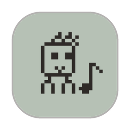
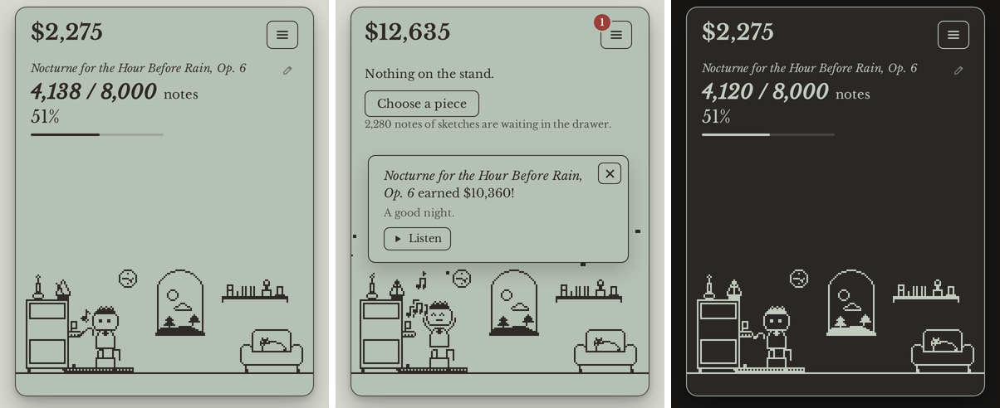
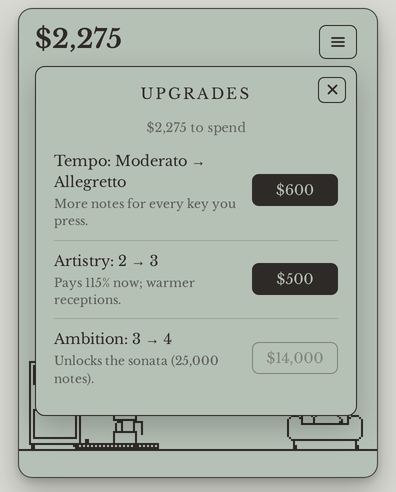
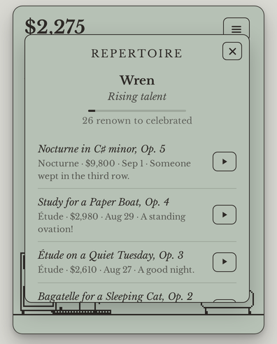
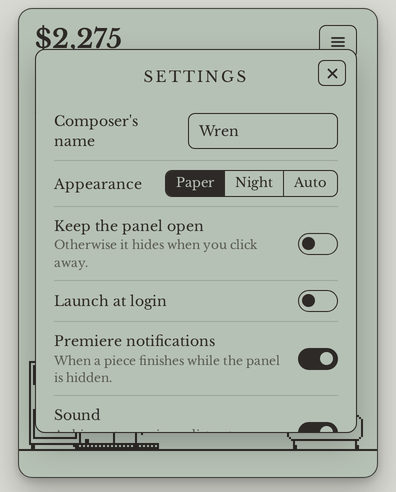

<p align="center">
  
</p>

<h1 align="center">Sonatina</h1>

<p align="center"><em>A little composer who lives in your menu bar and writes music while you work.</em></p>

<p align="center">
  
</p>

Your companion is an ambitious composer with very little discipline. **Every key you press, in any app, is a note on their manuscript.** Finish a piece and it premieres, earning a little money and a little renown. Spend it on their tempo, artistry and ambition, and they'll take on bigger forms — from a bagatelle to an opera — while you get on with your day.

It lives in the menu bar. Click the icon to see how they're doing; click anywhere else and the panel tucks itself away.

## Install

**Download** — grab the latest `Sonatina_x.y.z_universal.dmg` from [Releases](https://github.com/aidenyjin/desktop-pet/releases), open it, and drag Sonatina to Applications. The build is not notarized, so the first time you open it, right‑click the app → **Open** (or, on macOS 15, go to System Settings → Privacy & Security and choose **Open Anyway**).

**Or build it yourself** (needs the Xcode Command Line Tools, [Rust](https://rustup.rs) and [Node 20+](https://nodejs.org)):

```sh
git clone https://github.com/aidenyjin/desktop-pet.git
cd desktop-pet
./scripts/install.sh --open
```

That builds the app for your Mac and copies it to `/Applications`. Apps built locally carry no quarantine flag, so they open without ceremony.

### The one permission

To hear you type in other apps, macOS asks to let Sonatina *receive keystrokes* (System Settings → Privacy & Security → **Input Monitoring**). Sonatina increments a counter and discards the event; **which keys you press is never recorded, stored or sent anywhere**. There is no network code in the app. If you'd rather not grant it, only typing inside the panel counts and the composer mostly naps.

> Because the app is ad‑hoc signed, macOS ties the permission to the exact build. After updating, you may need to switch it on again.

## How it plays

| | |
|---|---|
| **Pieces** | Bagatelle · Étude · Nocturne · Sonata · Concerto · Symphony · Opera. Each needs a number of notes and pays when it premieres. Titles are generated (*Nocturne for the Hour Before Rain, Op. 6*), and you can rename them. |
| **Tempo** | Adagio → Prestissimo. More notes for every key you press. |
| **Artistry** | Better pay and warmer receptions on opening night. |
| **Ambition** | Unlocks the next, larger form. |
| **Renown** | Each premiere adds renown; the composer climbs from *Unknown* to *Legendary*. |
| **Repertoire** | Every finished piece, with what it earned — and a small generated tune for each you can listen to. |

The room is alive: the metronome swings at the piece's tempo while you type, the window's sky follows the real clock (and rains some days), the cat's tail flicks, and after a couple of quiet minutes the composer dozes off until you start again.

<p align="center">
  
  
  
</p>

## Settings

Paper or night appearance (or follow the system), launch at login, keep the panel open, premiere notifications, sound and a *play along* mode that sounds soft notes as you type. Right‑click the menu bar icon for a quick menu.

## Privacy and data

* Keystrokes are **counted, not recorded**. The counter lives in `~/Library/Application Support/com.aidenyjin.sonatina/keys.json`.
* Game state is in `save.json` next to it, written atomically with a rolling `.bak`.
* No analytics, no network requests, no third‑party services.

## Development

```sh
npm install
npm run dev          # the panel in a browser at http://localhost:1420 (keys typed on the page count)
npm run app:dev      # the real app via Tauri (needs Rust)
npm test             # game logic tests
npm run simulate     # pacing simulation
npm run shots        # screenshots of the panel and the scene
```

The Rust side is small — tray, panel, keystroke counting, persistence — and everything about the game is TypeScript with no framework. `docs/DESIGN.md` explains the ideas and the numbers. `scripts/check-macos-from-linux.sh` type‑checks the Rust code for macOS from a Linux machine.

## Credits

Inspired by *Little Writer Desktop Companion* by JSLegendDev. Type set in [Libre Baskerville](https://github.com/impallari/Libre-Baskerville) (OFL). MIT licensed.
